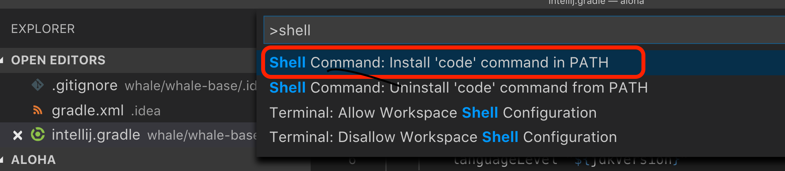

# setupfiles

---
Reference:
* [Qiita | Macで自動環境構築＆バックアップ(App Storeも)](https://qiita.com/takeo-asai/items/29724f94e2992fdc7246)

## Homebrew

### Prepare Brewfile

```bash
export HOMEBREW_BREWFILE=~/setupfiles/Brewfile
brew file init
```

### Restore Brewfile

```bash
brew file install Brewfile
```

## Atom

"Atom > Install Shell Commands"から`apm`を導入

### Prepare Atomfile

```bash
apm list -bi > Atomfile
```

### Restore from Atomfile
```bash
apm install --packages-file Atomfile
```

## Visual Studio code

1. `Command + Shift + P` でコマンドパレットを開く
1. "shell" で検索
1. `code` コマンドをインストールする

